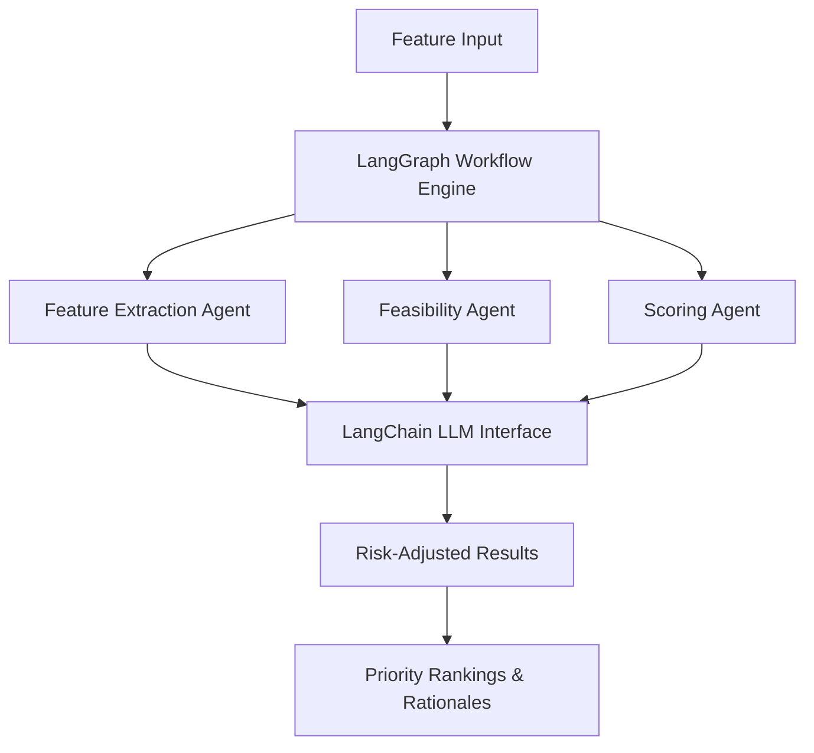

# **Feature Prioritization System**
## **Intelligent Multi-Agent Feature Analysis and Prioritization Platform**

---

## **🎯 Project Overview**

This repository contains an enterprise-grade **Feature Prioritization System** built on modern AI agent architecture using **LangGraph** and **LangChain**. The system intelligently analyzes product features and generates data-driven priority rankings using multiple specialized AI agents working in orchestrated workflows.

### **What This System Does**

- **Automated Feature Analysis**: Converts feature descriptions into structured business metrics (RICE scoring: Reach, Impact, Confidence, Effort)
- **Risk Assessment**: Evaluates delivery feasibility and implementation risks using AI-powered analysis
- **Intelligent Scoring**: Applies configurable prioritization methodologies with risk-adjusted penalties
- **Business Rationale**: Generates clear, actionable justifications for prioritization decisions
- **Enterprise Ready**: Includes audit trails, monitoring, and graceful degradation capabilities

---

## **🏗️ Technology Stack**

### **Core Framework**
- **LangGraph**: State-based multi-agent workflow orchestration
- **LangChain**: LLM abstraction layer and prompt management
- **Python 3.8+**: Primary development language
- **Pydantic**: Data validation and settings management

### **AI/LLM Integration**
- **OpenAI GPT Models**: Primary AI reasoning engine
- **Google Gemini**: Alternative LLM provider via LLPM gateway
- **Structured Prompts**: Engineered for consistent, reliable AI responses
- **Fallback Systems**: Deterministic analysis when AI unavailable

### **Data & Configuration**
- **JSON/CSV Support**: Flexible input/output formats
- **Environment-based Config**: Secure API key management
- **Policy-driven Scoring**: Configurable prioritization algorithms
- **Audit Logging**: Comprehensive decision tracking

---

## **🤖 Agent Architecture**

The system implements a **multi-agent architecture** where specialized AI agents collaborate through shared state:

### **Core Agents**

1. **Feature Extraction Agent**
   - Analyzes feature descriptions
   - Estimates business impact factors (reach, revenue, risk reduction)
   - Calculates implementation effort (engineering, complexity, dependencies)
   - Provides structured analysis with reasoning

2. **Feasibility Agent** *(Enhanced in v2)*
   - Evaluates delivery risk and implementation feasibility
   - Applies risk penalties to priority scores
   - Assesses delivery confidence levels
   - Provides risk-adjusted recommendations

3. **Scoring Agent**
   - Applies configurable scoring methodologies (RICE, ICE, custom)
   - Calculates final priority scores
   - Generates business rationales for decisions
   - Handles score normalization and ranking

### **Workflow Orchestration**



---

## **📁 Repository Structure**

```
feature_prioritizer/
├── config.py                 # Configuration management
├── models.py                 # Data models and validation
├── graph.py                  # LangGraph workflow definition
├── nodes.py                  # Agent implementations
├── llm_utils.py              # LLM integration utilities
├── monitoring.py             # Audit and performance tracking
├── run.py                    # Main execution script
├── requirements.txt          # Python dependencies
├── samples/                  # Example input files
│   ├── features.json         # Standard feature format
│   ├── fintech_features.csv  # Financial services examples
│   ├── healthcare_features.csv
│   └── ...
├── results/                  # Output files (JSON/CSV)
└── logs/                     # Audit trails and execution logs
```

### **Key Documentation**
- **TPM_Activity.md**: Comprehensive implementation guide for Technical Program Managers
- **FEATURE_PRIORITY_ARCHITECTURE.md**: Detailed system architecture documentation
- **HOW_TO_RUN.md**: Quick start and usage instructions
- **UseCase.md**: Business use cases and example scenarios

---

## **🚀 Quick Start**

### **1. Installation**
```bash
git clone https://github.com/nmansur0ct/Agents.git
cd Agents/feature_prioritizer
pip install -r requirements.txt
```

### **2. Configuration**
Create `.env` file with your API keys:
```properties
# OpenAI Configuration
OPENAI_API_AGENT_KEY=sk-proj-your-api-key-here
LLM_PROVIDER=openai
LLM_MODEL=gpt-3.5-turbo

# Alternative: Gemini Configuration
# LLPM_KEY=your-gemini-jwt-token
# LLM_PROVIDER=gemini
```

### **3. Basic Usage**
```bash
# Run with sample data
python run.py --file samples/features.json --metric RICE --verbose

# Save results automatically
python run.py --file samples/fintech_features.csv --metric RICE --auto-save
```

### **4. Expected Output**
- **JSON Results**: Detailed feature analysis with scores and rationales
- **CSV Export**: Tabular format for spreadsheet integration
- **Audit Logs**: Complete decision trail for compliance
- **Performance Metrics**: Execution statistics and LLM usage

---

## **🎛️ Configuration Options**

### **Scoring Methodologies**
- **RICE**: Reach × Impact × Confidence ÷ Effort
- **ICE**: Impact × Confidence ÷ Effort
- **Custom**: Define your own scoring algorithms

### **Risk Assessment Settings**
```python
# Light risk penalty (30%) - Agile teams
config.risk.risk_penalty = 0.3

# Heavy risk penalty (70%) - Enterprise/critical systems
config.risk.risk_penalty = 0.7

# Disable AI analysis (deterministic only)
config.risk.use_llm_analysis = False
```

### **LLM Provider Options**
- **OpenAI**: GPT-3.5-turbo, GPT-4 (requires API key)
- **Gemini**: Google's LLM via LLPM gateway (requires JWT token)
- **Auto-detection**: System selects provider based on available keys
- **Fallback Mode**: Deterministic analysis when AI unavailable

---

## **📊 Use Cases**

### **Product Management**
- **Feature Backlog Prioritization**: Rank hundreds of features objectively
- **Roadmap Planning**: Data-driven quarterly/annual planning
- **Stakeholder Communication**: Clear rationales for prioritization decisions

### **Technical Program Management**
- **Risk-Aware Planning**: Factor delivery risks into priority decisions
- **Resource Allocation**: Optimize engineering effort allocation
- **Cross-team Coordination**: Standardized prioritization across teams

### **Business Strategy**
- **ROI Optimization**: Maximize business value delivery
- **Competitive Analysis**: Prioritize features for market advantage
- **Investment Planning**: Data-driven budget allocation decisions

---

## **🔧 Advanced Features**

### **Enterprise Capabilities**
- **Audit Trails**: Complete decision history for compliance
- **Multi-tenant Support**: Isolated configurations per team/project
- **API Integration**: RESTful endpoints for system integration
- **Performance Monitoring**: Detailed metrics and observability

### **AI Enhancement Options**
- **Custom Prompt Templates**: Tailor AI analysis to your domain
- **Fine-tuning Support**: Adapt models to your specific use cases
- **Confidence Scoring**: Reliability metrics for AI decisions
- **Human-in-the-loop**: Optional manual review workflows

### **Extensibility**
- **Plugin Architecture**: Add custom agents and scoring algorithms
- **Integration APIs**: Connect to Jira, Azure DevOps, GitHub
- **Custom Metrics**: Define domain-specific evaluation criteria
- **Workflow Customization**: Adapt agent orchestration to your needs

---

## **📈 Benefits**

### **For Technical Teams**
- **Objective Prioritization**: Eliminate subjective bias in feature ranking
- **Risk Management**: Proactive identification of delivery challenges
- **Efficiency Gains**: Automate time-consuming analysis processes
- **Consistency**: Standardized evaluation across all features

### **For Business Teams**
- **Data-Driven Decisions**: Evidence-based prioritization rationales
- **Stakeholder Alignment**: Clear, defendable priority rankings
- **ROI Optimization**: Maximize business value from development efforts
- **Strategic Planning**: Long-term roadmap optimization

### **For Organizations**
- **Scalability**: Handle large feature backlogs efficiently
- **Transparency**: Auditable decision-making processes
- **Compliance**: Enterprise-grade governance capabilities
- **Innovation**: AI-powered insights for competitive advantage

---

## **🤝 Contributing**

This repository follows enterprise development practices:

1. **Branch Strategy**: Feature branches from `v2` main branch
2. **Code Standards**: Pydantic models, type hints, comprehensive documentation
3. **Testing**: Unit tests for agents, integration tests for workflows
4. **Documentation**: Keep TPM guides updated with architectural changes

### **Development Setup**
```bash
# Development dependencies
pip install -r requirements-dev.txt

# Run tests
python -m pytest tests/

# Code formatting
black feature_prioritizer/
mypy feature_prioritizer/
```

---

## **📄 License**

This project is licensed under the MIT License. See LICENSE file for details.

---

## **📞 Support**

For technical issues, feature requests, or implementation questions:
- **Repository Issues**: Use GitHub Issues for bug reports and feature requests
- **Documentation**: Comprehensive guides in TPM_Activity.md
- **Examples**: Multiple domain-specific samples in `/samples` directory

---

*This Feature Prioritization System represents a modern approach to product management, combining AI intelligence with enterprise-grade reliability for data-driven decision making.*
