# **TPM Implementation Guide: Adding FeasibilityAgent for Risk Assessment**

## ** Overview**

This guide helps Technical Program Managers (TPMs) implement the **FeasibilityAgent** that adds intelligent risk assessment to the feature prioritization system. The agent evaluates each feature's delivery risk and applies penalties to scores based on complexity and implementation challenges.


### **What the FeasibilityAgent Adds:**
-  **Risk Assessment**: Automatic evaluation of feature delivery risk
-  **Smart Scoring**: Risk penalties applied to final priority scores  
-  **Fallback Safety**: System works even without AI/LLM connectivity
-  **Better Decisions**: More accurate prioritization with risk considerations

### **System Workflow:**
```
Feature Input → Extract → Feasibility Assessment → Risk-Adjusted Scoring → Prioritized Output
```

---

## ** Architecture Overview**

### **🔹 BEFORE: Original System Architecture**


**Original Workflow:** `Feature Input → Extract → Score → Prioritize → Output`

**Limitations:**
- No risk assessment
- Scoring based only on business metrics (RICE/MoSCoW)
- No delivery feasibility consideration
- Higher chance of overcommitting to risky features

---

### **🔸 AFTER: Enhanced System with FeasibilityAgent**

```mermaid
graph TD
    A[Feature Input] --> B[LangGraph Workflow Engine]
    B --> C[Extract Node]
    B --> D[Feasibility Node - NEW]
    B --> E[Scorer Node - ENHANCED]
    B --> F[Prioritizer Node]
    
    C --> G[Feature Extraction]
    D --> H[🔍 Risk Assessment]
    E --> I[🎯 Risk-Adjusted Scoring]
    F --> J[Final Priority Rankings]
    
    style D fill:#e1f5fe,stroke:#01579b,stroke-width:3px
    style H fill:#f3e5f5,stroke:#4a148c,stroke-width:2px
    style I fill:#e8f5e8,stroke:#1b5e20,stroke-width:2px
```



**Enhanced Workflow:** `Feature Input → Extract → Feasibility Assessment → Risk-Adjusted Scoring → Prioritized Output`

### **Key Components Added:**
1. **🎛️ RiskPolicy Configuration** - Controls risk assessment behavior
2. **📊 Enhanced Data Models** - Store risk assessment results  
3. **🤖 Universal LLM Interface** - Multi-provider AI support with auto-detection
4. **🔍 FeasibilityAgent** - Core risk assessment logic
5. **⚡ Updated Workflow** - Integrated feasibility assessment into pipeline
6. **🎯 Risk-Aware Scoring** - Applies penalties based on risk factors

---

### **📈 Sample Output Comparison**

#### **🔹 BEFORE: Without FeasibilityAgent**
```json
{
  "prioritized_features": [
    {
      "name": "AI-Powered Recommendation Engine",
      "impact": 0.8,
      "effort": 0.9,
      "score": 0.889,
      "rationale": "High revenue impact; Complex engineering"
    },
    {
      "name": "User Profile Enhancement", 
      "impact": 0.6,
      "effort": 0.3,
      "score": 2.0,
      "rationale": "Moderate impact; Low effort"
    }
  ]
}
```

**Issues with original output:**
- ❌ AI feature scored high (0.889) despite being very risky
- ❌ No risk assessment information
- ❌ Could lead to overcommitment on complex features

---

#### **🔸 AFTER: With FeasibilityAgent**
```json
{
  "prioritized_features": [
    {
      "name": "User Profile Enhancement",
      "impact": 0.6,
      "effort": 0.3, 
      "score": 1.9,
      "rationale": "Moderate impact; Low effort | Risk-adjusted (Safe)",
      "feasibility": "High",
      "risk_factor": 0.2,
      "delivery_confidence": "Safe"
    },
    {
      "name": "AI-Powered Recommendation Engine",
      "impact": 0.8,
      "effort": 0.9,
      "score": 0.445,
      "rationale": "High revenue impact; Complex engineering | Risk-adjusted (HighRisk)",
      "feasibility": "Low", 
      "risk_factor": 0.9,
      "delivery_confidence": "HighRisk"
    }
  ]
}
```

**Improvements with FeasibilityAgent:**
- ✅ AI feature score reduced from 0.889 to 0.445 due to high risk
- ✅ Safer feature (User Profile) now prioritized higher
- ✅ Complete risk assessment data for informed decisions
- ✅ "Risk-adjusted" rationale shows penalty application
- ✅ Delivery confidence helps sprint planning

---

### **🎯 Risk Impact Analysis**

| Feature Type | Original Score | Risk Factor | Final Score | Impact |
|-------------|---------------|-------------|-------------|---------|
| **Simple CRUD** | 1.5 | 0.1 | **1.45** | 3% reduction |
| **API Integration** | 0.8 | 0.5 | **0.6** | 25% reduction |
| **AI/ML Feature** | 0.9 | 0.9 | **0.45** | 50% reduction |
| **Blockchain** | 0.7 | 1.0 | **0.35** | 50% reduction |

**Risk Penalty Formula:** `Final Score = Original Score × (1 - (Risk Penalty × Risk Factor))`
- Default Risk Penalty = 0.5 (configurable)
- Risk Factor ranges from 0.0 (safe) to 1.0 (very risky)

---

## **Why LangGraph: Technical Decision Analysis**

### **LangGraph vs LangChain: Quick Comparison**

| Aspect | LangChain | LangGraph | Our Choice |
|--------|-----------|-----------|------------|
| **Purpose** | General LLM framework | Stateful workflow orchestration | LangGraph |
| **Workflow Control** | Linear chains | Graph-based nodes with state | LangGraph |
| **State Management** | Manual state passing | Built-in state persistence | LangGraph |
| **Error Handling** | Basic try/catch | Node-level error recovery | LangGraph |
| **Debugging** | Limited visibility | Full execution tracing | LangGraph |
| **Scalability** | Chain complexity grows | Modular node architecture | LangGraph |
| **Testing** | Test entire chains | Test individual nodes | LangGraph |

### **Why We Chose LangGraph**

**Workflow Requirements:**
- Multi-step feature processing pipeline
- State persistence between processing stages
- Conditional logic based on risk assessment results
- Error recovery at individual processing steps
- Ability to extend with new processing nodes

**LangGraph Advantages for Our Use Case:**

**State-Driven Processing:**
```python
# LangGraph: Built-in state management
workflow_state = {
    "features": [...],
    "risk_assessments": [...],
    "scores": [...]
}
# State automatically flows between nodes
```

**Node-Based Architecture:**
```python
# Each processing step is an independent, testable node
workflow.add_node("extract", extractor_node)
workflow.add_node("feasibility", feasibility_node) 
workflow.add_node("score", scorer_node)
workflow.add_node("prioritize", prioritizer_node)
```

**Conditional Flows:**
```python
# LangGraph: Easy conditional routing
workflow.add_conditional_edges(
    "feasibility",
    lambda x: "score" if x["risk_factor"] < 0.8 else "manual_review"
)
```

**Error Recovery:**
```python
# LangGraph: Node-level error handling
def feasibility_node(state):
    try:
        return assess_risk(state)
    except LLMError:
        return fallback_assessment(state)  # Graceful degradation
```

### **Implementation Benefits Realized**

**Modularity:** Each processing step (extract, assess, score, prioritize) is an independent node that can be:
- Tested in isolation
- Modified without affecting other steps
- Reused in different workflows
- Debugged with full state visibility

**Maintainability:** Adding new features like risk assessment required:
- Creating one new node (feasibility_node)
- Adding state flow edges
- No changes to existing node logic

**Reliability:** Built-in state management ensures:
- No data loss between processing steps
- Automatic error recovery with fallback options
- Full execution traceability for debugging

**Performance:** Graph compilation optimizes:
- Node execution order
- State transitions
- Memory usage during processing

---

## ** Implementation Steps**

### **Step 1: Environment Setup**

```bash
# 1. Clone the repository
git clone https://github.com/nmansur0ct/Agents.git
cd Agents

# 2. Fetch all latest branches and updates from remote
git fetch --all

# 3. Switch to the v2 branch (create local if needed)
git checkout v2 || git checkout -b v2 origin/v2

# 4. Discard all local changes and reset to match remote v2 branch exactly
git reset --hard origin/v2

# 5. Clean up any untracked files or directories (optional but recommended)
git clean -fd

# 6. Verify status — it should show "nothing to commit, working tree clean"
git status

# 7. Install dependencies
pip install -r requirements.txt
```

### **Step 2: Verify Current System**
```bash
# Test the system works before making changes
python run.py --file samples/features.json --metric RICE --verbose
```
**Create `.env` file** (choose one option):

**File to create**: `.env` (in the `feature_prioritizer` folder)

```bash
# Create the environment file
touch .env
```

**Add this content to `.env`**:
```properties
# Feature Prioritization System Configuration
# Replace the API key with your actual OpenAI key

# OpenAI Configuration (Primary option)
OPENAI_API_AGENT_KEY=sk-proj-your-actual-openai-api-key-here
LLM_PROVIDER=openai
LLM_MODEL=gpt-3.5-turbo
LLM_TEMPERATURE=0.3
LLM_MAX_TOKENS=500
LLM_TIMEOUT=30

# Alternative: Gemini Configuration (if using Google's API)
# LLMP_KEY=your-gemini-jwt-token-here
# LLM_PROVIDER=gemini

# System Settings
MONITORING_ENABLED=true
LOG_DIRECTORY=logs
```
### **Step 2: Verify System**

```bash
# Test current system
cd feature_prioritizer
python run.py --file samples/features.json --metric RICE --verbose

# Test LLM connectivity (optional)
python -c "from llm_utils import call_llm_json; result, error = call_llm_json('Test'); print(' LLM Ready' if not error else f'⚠️ {error}')"
```

---

## **💻 All Code Changes in One Place**

### **File 1: `config.py` - Add RiskPolicy**

**Add after the imports (around line 9):**

```python
class RiskPolicy(BaseModel):
    """Risk assessment configuration for feasibility validation."""
    risk_penalty: float = Field(default=0.5, ge=0, le=1, description="Risk penalty multiplier")
    enable_feasibility_agent: bool = Field(default=True, description="Enable feasibility agent")
    use_llm_analysis: bool = Field(default=True, description="Use LLM for risk analysis")
```

**In Config class, change this line:**
```python
# FIND:
llm_enabled: bool = Field(default=False, description="Enable LLM enhancements...")

# REPLACE WITH:
llm_enabled: bool = Field(default=True, description="Enable LLM enhancements for factor analysis and rationale generation")
```

**In Config class, add after monitoring field:**
```python
# Risk assessment configuration
risk: RiskPolicy = Field(default_factory=lambda: RiskPolicy(), description="Risk assessment configuration")
```

---

### **File 2: `models.py` - Add Risk Assessment Fields**

**In FeatureSpec class, add after `notes` field:**

```python
# Risk assessment fields - CRITICAL for output population
feasibility: Optional[str] = Field(None, description="Implementation feasibility: Low|Medium|High")
risk_factor: Optional[float] = Field(0.4, ge=0, le=1, description="Risk factor (0=safe, 1=risky)")
delivery_confidence: Optional[str] = Field(None, description="Confidence: Safe|MediumRisk|HighRisk")
```

**In ScoredFeature class, add after `rationale` field:**

```python
# Risk assessment fields (carried from FeatureSpec) - CRITICAL for CSV output
feasibility: Optional[str] = Field(None, description="Implementation feasibility: Low|Medium|High")
risk_factor: Optional[float] = Field(None, ge=0, le=1, description="Risk factor (0=safe, 1=risky)")
delivery_confidence: Optional[str] = Field(None, description="Confidence: Safe|MediumRisk|HighRisk")
```

---

### **File 3: `llm_utils.py` - Add Universal LLM Function**

**Add this complete function (after existing imports):**

```python
def call_llm_json(prompt: str, model: str = "gpt-3.5-turbo", 
                  temperature: float = 0.3, provider: str = "auto") -> Tuple[Optional[Dict], Optional[str]]:
    """
    Universal LLM JSON call supporting OpenAI and Gemini via LLPM gateway.
    Auto-detects provider based on available environment variables.
    """
    import os
    import json
    import requests
    from typing import Dict, Optional, Tuple
    
    # Auto-detect provider if not specified
    if provider == "auto":
        if os.getenv("LLPM_KEY"):
            provider = "gemini"
        elif os.getenv("OPENAI_API_AGENT_KEY"):
            provider = "openai"
        else:
            return None, "No API keys found for LLM providers"
    
    try:
        if provider == "gemini":
            # Use LLPM gateway for Gemini
            url = "https://llpm.gateway.ai/v1/chat/completions"
            headers = {
                "Authorization": f"Bearer {os.getenv('LLPM_KEY')}",
                "Content-Type": "application/json"
            }
            data = {
                "model": "gemini-1.5-flash",
                "messages": [{"role": "user", "content": prompt}],
                "temperature": temperature
            }
            response = requests.post(url, headers=headers, json=data, timeout=30)
            response.raise_for_status()
            content = response.json()["choices"][0]["message"]["content"]
            return json.loads(content), None
            
        elif provider == "openai":
            # Use OpenAI directly
            from openai import OpenAI
            client = OpenAI(api_key=os.getenv("OPENAI_API_AGENT_KEY"))
            
            response = client.chat.completions.create(
                model=model,
                messages=[{"role": "user", "content": prompt}],
                temperature=temperature,
                max_tokens=500
            )
            content = response.choices[0].message.content
            if content is None:
                return None, "Received empty response from OpenAI"
            return json.loads(content), None
            
        else:
            return None, f"Unsupported provider: {provider}"
            
    except json.JSONDecodeError as e:
        return None, f"JSON decode error: {str(e)}"
    except requests.exceptions.RequestException as e:
        return None, f"Connection error: {str(e)}"
    except Exception as e:
        return None, f"Unexpected error: {str(e)}"
```

---

### **File 4: `agents_feasibility.py` - Create New File**

**Create this complete new file:**

```python
"""
FeasibilityAgent - AI-Enhanced Risk Assessment Module
Supports both LLM-enhanced analysis and deterministic fallback
"""

from typing import List, Dict, Any, Optional
from models import FeatureSpec
from config import Config
from llm_utils import call_llm_json
from monitoring import get_system_monitor

class FeasibilityAgent:
    def __init__(self, config: Config):
        self.config = config
        self.monitor = get_system_monitor() if config.monitoring.enabled else None
    
    def _analyze_with_llm(self, spec: FeatureSpec) -> Dict[str, Any]:
        """Use LLM to analyze feasibility and risk factors."""
        if not self.config.llm_enabled or not self.config.risk.use_llm_analysis:
            print(f"LLM disabled, using deterministic analysis for {spec.name}")
            return self._analyze_deterministic(spec)
        
        prompt = f"""
            Analyze the implementation feasibility and delivery risk for this feature:

            Feature Name: {spec.name}
            Engineering Effort: {spec.engineering:.2f} (0=low, 1=high)
            Dependency Complexity: {spec.dependency:.2f} (0=low, 1=high)
            Implementation Complexity: {spec.complexity:.2f} (0=low, 1=high)
            Notes: {' | '.join(spec.notes)}

            Assess:
            1. Implementation feasibility (Low/Medium/High)
            2. Risk factor (0.0-1.0, where 0=safe, 1=very risky)  
            3. Delivery confidence (Safe/MediumRisk/HighRisk)

            Please respond with valid JSON format:
            {{
            "feasibility": "High",
            "risk_factor": 0.3,
            "delivery_confidence": "Safe",
            "reasoning": "explanation here"
            }}
        """
        
        try:
            result, error = call_llm_json(prompt, model=self.config.llm_model, temperature=self.config.llm_temperature)
            
            if error or not result:
                print(f"LLM failed for {spec.name}: {error}")
                return self._analyze_deterministic(spec)
            
            print(f"LLM analysis complete for {spec.name}: {result.get('feasibility', 'Unknown')}")
            return result
            
        except Exception as e:
            print(f"LLM error for {spec.name}: {str(e)}")
            return self._analyze_deterministic(spec)
    
    def _analyze_deterministic(self, spec: FeatureSpec) -> Dict[str, Any]:
        """Deterministic analysis using keywords and complexity scores."""
        print(f"Using deterministic analysis for {spec.name}")
        
        # Risk keywords detection
        high_risk_keywords = ['ai', 'machine learning', 'blockchain', 'real-time', 'integration', 'api', 'third-party']
        medium_risk_keywords = ['database', 'authentication', 'payment', 'security', 'performance']
        
        notes_text = ' '.join(spec.notes).lower()
        
        # Calculate base risk from complexity factors
        complexity_risk = (spec.engineering + spec.dependency + spec.complexity) / 3
        
        # Adjust risk based on keywords
        keyword_risk = 0.0
        if any(keyword in notes_text for keyword in high_risk_keywords):
            keyword_risk = 0.3
        elif any(keyword in notes_text for keyword in medium_risk_keywords):
            keyword_risk = 0.15
        
        final_risk = min(1.0, complexity_risk + keyword_risk)
        
        # Determine feasibility and confidence
        if final_risk <= 0.3:
            feasibility = "High"
            confidence = "Safe"
        elif final_risk <= 0.6:
            feasibility = "Medium"
            confidence = "MediumRisk"
        else:
            feasibility = "Low"
            confidence = "HighRisk"
        
        return {
            "feasibility": feasibility,
            "risk_factor": final_risk,
            "delivery_confidence": confidence,
            "reasoning": f"Deterministic analysis: complexity={complexity_risk:.2f}, keywords={keyword_risk:.2f}"
        }
    
    def assess_feature(self, spec: FeatureSpec) -> FeatureSpec:
        """Assess risk for a single feature."""
        print(f"Analyzing feasibility for: {spec.name}")
        
        # Log assessment start
        if self.monitor:
            self.monitor.audit_trail.log_event(
                agent_name="feasibility_agent",
                event_type="feature_assessment_start",
                details={"feature_name": spec.name}
            )
        
        # Perform analysis
        analysis = self._analyze_with_llm(spec)
        
        # Create new FeatureSpec with risk assessment data
        new_spec = FeatureSpec(
            name=spec.name,
            reach=spec.reach,
            revenue=spec.revenue,
            risk_reduction=spec.risk_reduction,
            engineering=spec.engineering,
            dependency=spec.dependency,
            complexity=spec.complexity,
            notes=spec.notes + [f"Risk Assessment: {analysis.get('reasoning', 'No reasoning')}"],
            feasibility=analysis["feasibility"],
            risk_factor=analysis["risk_factor"],
            delivery_confidence=analysis["delivery_confidence"]
        )
        
        # Log assessment completion
        if self.monitor:
            self.monitor.audit_trail.log_event(
                agent_name="feasibility_agent",
                event_type="feature_assessed",
                details={
                    "feature_name": spec.name,
                    "feasibility": new_spec.feasibility,
                    "risk_factor": new_spec.risk_factor,
                    "delivery_confidence": new_spec.delivery_confidence
                }
            )
        
        return new_spec
    
    def enrich(self, specs: List[FeatureSpec], errors: List[str]) -> List[FeatureSpec]:
        """Enrich all features with AI-enhanced risk assessment."""
        print(f"FeasibilityAgent.enrich called with {len(specs)} features")
        
        if not self.config.risk.enable_feasibility_agent:
            print("FeasibilityAgent disabled in configuration")
            return specs
        
        enriched_specs = []
        
        for spec in specs:
            try:
                enriched_spec = self.assess_feature(spec)
                enriched_specs.append(enriched_spec)
            except Exception as e:
                print(f"❌ Error assessing {spec.name}: {str(e)}")
                errors.append(f"FeasibilityAgent error for {spec.name}: {str(e)}")
                # Add original spec with default risk values
                default_spec = FeatureSpec(
                    name=spec.name,
                    reach=spec.reach,
                    revenue=spec.revenue,
                    risk_reduction=spec.risk_reduction,
                    engineering=spec.engineering,
                    dependency=spec.dependency,
                    complexity=spec.complexity,
                    notes=spec.notes,
                    feasibility="Medium",
                    risk_factor=0.5,
                    delivery_confidence="MediumRisk"
                )
                enriched_specs.append(default_spec)
        
        print(f"FeasibilityAgent.enrich completed - processed {len(enriched_specs)} features")
        return enriched_specs
```

---

### **File 5: `graph.py` - Update Workflow**

**Update import at top:**
```python
from nodes import extractor_node, feasibility_node, scorer_node, prioritizer_node
```

**In `_build_graph` method, replace the workflow section with:**
```python
# Add feasibility wrapper
def feasibility_with_config(state: State) -> State:
    return feasibility_node(state, self.config)

# Add all nodes
workflow.add_node("extract", extractor_with_config)
workflow.add_node("feasibility", feasibility_with_config)
workflow.add_node("score", scorer_with_config)
workflow.add_node("prioritize", prioritizer_with_config)

# Define the flow: START -> extract -> feasibility -> score -> prioritize -> END
workflow.set_entry_point("extract")
workflow.add_edge("extract", "feasibility")      # Extract goes to Feasibility
workflow.add_edge("feasibility", "score")        # Feasibility goes to Score
workflow.add_edge("score", "prioritize")         # Score goes to Prioritize
workflow.add_edge("prioritize", END)             # Prioritize goes to End

return workflow.compile()  # CRITICAL: Must return compiled workflow
```

---

### **File 6: `nodes.py` - Add Feasibility Node and Risk Processing**

**Add import after line 17:**
```python
from agents_feasibility import FeasibilityAgent
```

**Add this complete function after `extractor_node`:**
```python
def feasibility_node(state: State, config: Optional[Config] = None) -> State:
    """
    Agent 2: Feasibility Agent - Assesses implementation risk and delivery confidence
    """
    print("Feasibility Node: Starting risk assessment")
    
    # Apply monitoring if enabled
    if config and config.monitoring.enabled:
        monitor = get_system_monitor()
        decorator = monitor.get_monitoring_decorator("feasibility_agent", "assess_risk")
        return decorator(_feasibility_node_impl)(state, config)
    else:
        return _feasibility_node_impl(state, config)

def _feasibility_node_impl(state: State, config: Optional[Config] = None) -> State:
    """Implementation of feasibility node."""
    cfg = config or Config.default()
    
    if "errors" not in state:
        state["errors"] = []
    
    extracted_output = state.get("extracted")
    if not extracted_output or not hasattr(extracted_output, 'features'):
        state["errors"].append("feasibility_node:no_extracted_features")
        return state
    
    print(f" Feasibility Node: Processing {len(extracted_output.features)} features")
    
    feasibility_agent = FeasibilityAgent(cfg)
    enriched_features = feasibility_agent.enrich(extracted_output.features, state["errors"])
    
    extracted_output.features = enriched_features
    state["extracted"] = extracted_output
    
    print("Feasibility Node: Completed risk assessment")
    return state
```

**In `_extractor_node_impl`, update FeatureSpec creation to include risk fields:**
```python
# Find the FeatureSpec creation and ADD these fields:
notes=final_notes,
# Risk assessment fields (will be populated by FeasibilityAgent)
feasibility=None,
risk_factor=0.4,  # Default risk factor
delivery_confidence=None
```

**In `_scorer_node_impl`, replace the ScoredFeature creation with:**
```python
# Apply risk penalty if available
final_score = score
risk_note = ""

if hasattr(feature, 'risk_factor') and feature.risk_factor is not None:
    risk_multiplier = 1 - (config.risk.risk_penalty * feature.risk_factor)
    final_score = score * risk_multiplier
    risk_note = f" | Risk-adjusted ({getattr(feature, 'delivery_confidence', 'Unknown')})"

scored_features.append(ScoredFeature(
    name=feature.name,
    impact=impact,
    effort=effort, 
    score=final_score,
    rationale=rationale + risk_note,
    # Include risk assessment fields in final output
    feasibility=getattr(feature, 'feasibility', None),
    risk_factor=getattr(feature, 'risk_factor', None),
    delivery_confidence=getattr(feature, 'delivery_confidence', None)
))
```

**In `_prioritizer_node_impl`, update enhanced_feature creation:**
```python
enhanced_feature = ScoredFeature(
    name=feature.name,
    impact=feature.impact,
    effort=feature.effort,
    score=feature.score,
    rationale=enhanced_rationale,
    # Preserve risk fields
    feasibility=feature.feasibility,
    risk_factor=feature.risk_factor,
    delivery_confidence=feature.delivery_confidence
)
```

---

### **File 7: `monitoring.py` - Add Event Logging**

**Add this method to AuditTrail class (around line 245):**
```python
def log_event(self, agent_name: str, event_type: str, details: Dict[str, Any]):
    """Log a simple event for agent activities."""
    try:
        # Create a simple audit entry for the event
        entry = AuditLogEntry(
            timestamp=datetime.now(),
            agent_name=agent_name,
            action=event_type,
            input_hash=self._hash_data(details),
            output_hash=self._hash_data(details),
            config_snapshot={},
            execution_time=0.0,
            success=True,
            decision_factors=details,
            confidence_score=1.0,
            error_details=None
        )
        
        self.audit_entries.append(entry)
        self._log_audit_entry(entry)
        
        print(f"Audit: {agent_name} - {event_type}")
        
    except Exception as e:
        print(f"Audit logging failed: {str(e)}")
```

---

## ** Testing the Implementation**

### **Basic Test**
```bash
cd feature_prioritizer
python run.py --file samples/features.json --metric RICE --auto-save --verbose
```

### **With LLM Enhancement**
```bash
python run.py --file samples/features.json --metric RICE --llm --auto-save
```

### **Expected Output Format**
```json
{
  "prioritized_features": [
    {
      "name": "Payment Integration",
      "impact": 0.7,
      "effort": 0.735,
      "score": 0.357,
      "rationale": "Revenue impact; Engineering heavy | Risk-adjusted (HighRisk)",
      "feasibility": "Low",
      "risk_factor": 1.0,
      "delivery_confidence": "HighRisk"
    }
  ]
}
```

### **Verification Checklist**
- System runs without errors
- Risk fields are populated (not null)
- Rationale includes "Risk-adjusted" text
- Scores are modified based on risk factors
- Works with and without LLM connectivity

---

## ** Key Benefits Achieved**

1. ** Enhanced Risk Assessment**: Features now include feasibility analysis
2. ** Risk-Adjusted Scoring**: High-risk features get score penalties automatically
3. ** AI-Powered Analysis**: Uses LLM for intelligent risk evaluation with fallback
4. ** Better Prioritization**: More accurate feature ranking with risk considerations
5. ** Production Ready**: Full monitoring, error handling, and configuration support

---

## ** Next Steps (Optional Enhancements)**

1. **Advanced Risk Rules**: Customize risk penalties per project type
2. **Industry Patterns**: Add domain-specific risk keywords and patterns  
3. **Historical Learning**: Track actual delivery outcomes to improve risk predictions
4. **Integration**: Connect with JIRA/Azure DevOps for automated risk assessment

